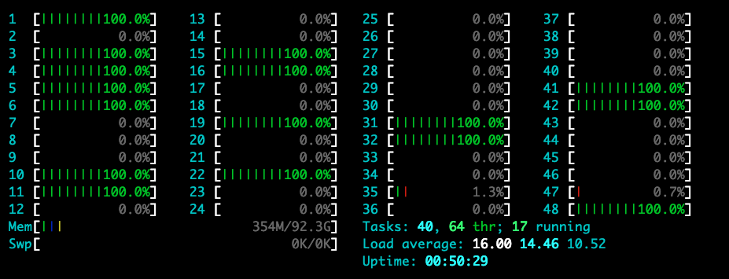
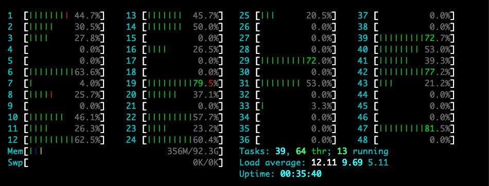
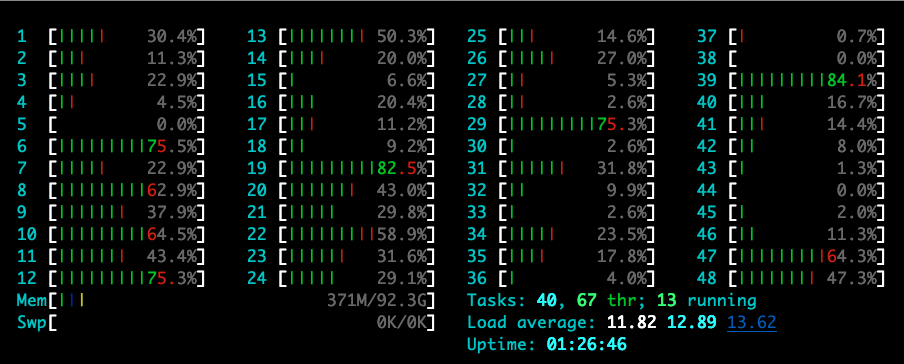

# cpuworker

## Status

Working in process.

## Proposal For Go

[proposal: runtime/scheduler: it is time to bring Go a better scheduler maybe like Linux Kernel's CFS](https://github.com/golang/go/issues/51071)

## Run the Demo

Make sure the GOMAXPROCS is bigger than 1 and there is at least `GOMAXPROCS` physical OS threads available.

Run the [example/demo.go](example/demo.go).

```bash
# feel free to tune the parameters below if you like

# cmd 1
while true; do sleep 1;ab -s10000000 -c 10 -n 60 http://127.0.0.1:8080/delay1ms; done

# cmd 2
while true; do sleep 1;ab -s10000000 -c 10 -n 60 http://127.0.0.1:8080/checksumWithoutCpuWorker; done

# cmd 3
while true; do sleep 1;ab -s10000000 -c 10 -n 60 http://127.0.0.1:8080/checksumWithCpuWorker; done

# cmd 4
while true; do sleep 1;ab -s10000000 -c 10 -n 60 http://127.0.0.1:8080/checksumSmallTaskWithCpuWorker; done
```

Step 1: Killall already existing cmd `x`, then run the cmd 1.

Step 2: Killall already existing cmd `x`, then run the cmd 1 and cmd 2 simultaneously.

Step 3: Killall already existing cmd `x`, then run the cmd 1 and cmd 3 simultaneously.

Step 4: Killall already existing cmd `x`, then run the cmd 1, cmd 3 and cmd 4 simultaneously.

Please watch the latency which cmd 1 and cmd 4 yields carefully at every step and then you would catch the difference :-D

## Test Result On AWS

The server [example/demo.go](example/demo.go) is running at an aws instance `c5d.12xlarge` and with the env `GOMAXPROCS` set to 16.

```bash
$ GOMAXPROCS=16 ./cpuworker-demo

GOMAXPROCS: 16 cpuWorkerMaxP: 12 length of crc32 bs: 262144
```

The benchmark tool is running at an aws instance `c5d.4xlarge`. The two machine is running at a same cluster placement group.

```bash
# please complete the server IP
SeverIP=x.x.x.x

# cmd 1
while true; do sleep 1;ab -s10000000 -c 100 -n 60000 http://$SeverIP:8080/delay1ms; done

# cmd 2
while true; do sleep 1;ab -s10000000 -c 100 -n 10000 http://$SeverIP:8080/checksumWithoutCpuWorker; done

# cmd 3
while true; do sleep 1;ab -s10000000 -c 100 -n 10000 http://$SeverIP:8080/checksumWithCpuWorker; done

# cmd 4
while true; do sleep 1;ab -s10000000 -c 100 -n 10000 http://$SeverIP:8080/checksumSmallTaskWithCpuWorker; done
```

Step 1: Killall already existing cmd `x`, then run the cmd 1 (run the standalone benchmark of delay1ms).

```bash
$ ab -s10000000 -c 100 -n 60000 http://$SeverIP:8080/delay1ms
This is ApacheBench, Version 2.3 <$Revision: 1879490 $>
Copyright 1996 Adam Twiss, Zeus Technology Ltd, http://www.zeustech.net/
Licensed to The Apache Software Foundation, http://www.apache.org/

Benchmarking 172.31.47.63 (be patient)
Completed 1000 requests
Completed 2000 requests
Completed 3000 requests
Completed 4000 requests
Completed 5000 requests
Completed 6000 requests
Completed 7000 requests
Completed 8000 requests
Completed 9000 requests
Completed 10000 requests
Finished 10000 requests

Server Software:
Server Hostname:        172.31.47.63
Server Port:            8080

Document Path:          /delay1ms
Document Length:        37 bytes

Concurrency Level:      100
Time taken for tests:   0.225 seconds
Complete requests:      10000
Failed requests:        1066
   (Connect: 0, Receive: 0, Length: 1066, Exceptions: 0)
Total transferred:      1538813 bytes
HTML transferred:       368813 bytes
Requests per second:    44413.06 [#/sec] (mean)
Time per request:       2.252 [ms] (mean)
Time per request:       0.023 [ms] (mean, across all concurrent requests)
Transfer rate:          6674.16 [Kbytes/sec] received

Connection Times (ms)
              min  mean[+/-sd] median   max
Connect:        0    0   0.2      0       1
Processing:     1    2   0.4      2       4
Waiting:        1    2   0.4      1       4
Total:          1    2   0.5      2       5
ERROR: The median and mean for the waiting time are more than twice the standard
       deviation apart. These results are NOT reliable.

Percentage of the requests served within a certain time (ms)
  50%      2
  66%      2
  75%      2
  80%      2
  90%      3
  95%      3
  98%      4
  99%      4
 100%      5 (longest request)
```

Step 2: Killall already existing cmd `x`, then run the cmd 1 and cmd 2 simultaneously (run the benchmark of delay1ms with a very heavy cpu load without cpuworker).

Curent CPU load of the server side (and please note that the load average is already reaching the `GOMAXPROCS`, i.e. 16 in this case):



```bash
$ ab -s10000000 -c 100 -n 60000 http://$SeverIP:8080/delay1ms
This is ApacheBench, Version 2.3 <$Revision: 1879490 $>
Copyright 1996 Adam Twiss, Zeus Technology Ltd, http://www.zeustech.net/
Licensed to The Apache Software Foundation, http://www.apache.org/

Benchmarking 172.31.47.63 (be patient)
Completed 1000 requests
Completed 2000 requests
Completed 3000 requests
Completed 4000 requests
Completed 5000 requests
Completed 6000 requests
Completed 7000 requests
Completed 8000 requests
Completed 9000 requests
Completed 10000 requests
Finished 10000 requests

Server Software:
Server Hostname:        172.31.47.63
Server Port:            8080

Document Path:          /delay1ms
Document Length:        38 bytes

Concurrency Level:      100
Time taken for tests:   31.565 seconds
Complete requests:      10000
Failed requests:        5266
   (Connect: 0, Receive: 0, Length: 5266, Exceptions: 0)
Total transferred:      1553977 bytes
HTML transferred:       383977 bytes
Requests per second:    316.80 [#/sec] (mean)
Time per request:       315.654 [ms] (mean)
Time per request:       3.157 [ms] (mean, across all concurrent requests)
Transfer rate:          48.08 [Kbytes/sec] received

Connection Times (ms)
              min  mean[+/-sd] median   max
Connect:        0    0   0.1      0       1
Processing:    50  314  99.3    293    1038
Waiting:       11  305 102.5    292    1038
Total:         50  314  99.3    293    1038

Percentage of the requests served within a certain time (ms)
  50%    293
  66%    323
  75%    353
  80%    380
  90%    454
  95%    504
  98%    604
  99%    615
 100%   1038 (longest request)
```

Step 3: Killall already existing cmd `x`, then run the cmd 1 and cmd 3 simultaneously (run the benchmark of delay1ms with a very heavy cpu load with cpuworker).

Curent CPU load of the server side (and please note that the load average is near the `cpuWorkerMaxP`, i.e. 12 in this case, and you could set this parameter by yourself):



```bash
$ ab -s10000000 -c 100 -n 60000 http://$SeverIP:8080/delay1ms
This is ApacheBench, Version 2.3 <$Revision: 1879490 $>
Copyright 1996 Adam Twiss, Zeus Technology Ltd, http://www.zeustech.net/
Licensed to The Apache Software Foundation, http://www.apache.org/

Benchmarking 172.31.47.63 (be patient)
Completed 1000 requests
Completed 2000 requests
Completed 3000 requests
Completed 4000 requests
Completed 5000 requests
Completed 6000 requests
Completed 7000 requests
Completed 8000 requests
Completed 9000 requests
Completed 10000 requests
Finished 10000 requests


Server Software:
Server Hostname:        172.31.47.63
Server Port:            8080

Document Path:          /delay1ms
Document Length:        37 bytes

Concurrency Level:      100
Time taken for tests:   0.234 seconds
Complete requests:      10000
Failed requests:        1005
   (Connect: 0, Receive: 0, Length: 1005, Exceptions: 0)
Total transferred:      1538877 bytes
HTML transferred:       368877 bytes
Requests per second:    42655.75 [#/sec] (mean)
Time per request:       2.344 [ms] (mean)
Time per request:       0.023 [ms] (mean, across all concurrent requests)
Transfer rate:          6410.35 [Kbytes/sec] received

Connection Times (ms)
              min  mean[+/-sd] median   max
Connect:        0    0   0.2      0       1
Processing:     1    2   0.5      2       4
Waiting:        1    2   0.4      2       4
Total:          1    2   0.5      2       5

Percentage of the requests served within a certain time (ms)
  50%      2
  66%      2
  75%      2
  80%      3
  90%      3
  95%      4
  98%      4
  99%      4
 100%      5 (longest request)
```

Step 4: Killall already existing cmd `x`, then run the cmd 1, cmd 3 and cmd 4 simultaneously (run the benchmark of delay1ms and checksumSmallTaskWithCpuWorker with a very heavy cpu load with cpuworker).

Curent CPU load of the server side (and please note that the load average is near the `cpuWorkerMaxP`, i.e. 12 in this case, and you could set this parameter by yourself):



```bash
$ ab -s10000000 -c 100 -n 60000 http://$SeverIP:8080/delay1ms

This is ApacheBench, Version 2.3 <$Revision: 1879490 $>
Copyright 1996 Adam Twiss, Zeus Technology Ltd, http://www.zeustech.net/
Licensed to The Apache Software Foundation, http://www.apache.org/

Benchmarking 172.31.47.63 (be patient)
Completed 1000 requests
Completed 2000 requests
Completed 3000 requests
Completed 4000 requests
Completed 5000 requests
Completed 6000 requests
Completed 7000 requests
Completed 8000 requests
Completed 9000 requests
Completed 10000 requests
Finished 10000 requests


Server Software:
Server Hostname:        172.31.47.63
Server Port:            8080

Document Path:          /delay1ms
Document Length:        37 bytes

Concurrency Level:      100
Time taken for tests:   0.238 seconds
Complete requests:      10000
Failed requests:        1038
   (Connect: 0, Receive: 0, Length: 1038, Exceptions: 0)
Total transferred:      1538857 bytes
HTML transferred:       368857 bytes
Requests per second:    42031.11 [#/sec] (mean)
Time per request:       2.379 [ms] (mean)
Time per request:       0.024 [ms] (mean, across all concurrent requests)
Transfer rate:          6316.39 [Kbytes/sec] received

Connection Times (ms)
              min  mean[+/-sd] median   max
Connect:        0    0   0.2      0       1
Processing:     1    2   0.5      2       5
Waiting:        1    2   0.4      1       5
Total:          1    2   0.6      2       5
ERROR: The median and mean for the waiting time are more than twice the standard
       deviation apart. These results are NOT reliable.

Percentage of the requests served within a certain time (ms)
  50%      2
  66%      2
  75%      2
  80%      3
  90%      3
  95%      4
  98%      4
  99%      4
 100%      5 (longest request)
 
$ ab -s10000000 -c 100 -n 10000 http://$SeverIP:8080/checksumSmallTaskWithCpuWorker

This is ApacheBench, Version 2.3 <$Revision: 1879490 $>
Copyright 1996 Adam Twiss, Zeus Technology Ltd, http://www.zeustech.net/
Licensed to The Apache Software Foundation, http://www.apache.org/

Benchmarking 172.31.47.63 (be patient)
Completed 1000 requests
Completed 2000 requests
Completed 3000 requests
Completed 4000 requests
Completed 5000 requests
Completed 6000 requests
Completed 7000 requests
Completed 8000 requests
Completed 9000 requests
Completed 10000 requests
Finished 10000 requests


Server Software:
Server Hostname:        172.31.47.63
Server Port:            8080

Document Path:          /checksumSmallTaskWithCpuWorker
Document Length:        71 bytes

Concurrency Level:      100
Time taken for tests:   0.469 seconds
Complete requests:      10000
Failed requests:        9157
   (Connect: 0, Receive: 0, Length: 9157, Exceptions: 0)
Total transferred:      1889624 bytes
HTML transferred:       719624 bytes
Requests per second:    21333.56 [#/sec] (mean)
Time per request:       4.687 [ms] (mean)
Time per request:       0.047 [ms] (mean, across all concurrent requests)
Transfer rate:          3936.76 [Kbytes/sec] received

Connection Times (ms)
              min  mean[+/-sd] median   max
Connect:        0    0   0.3      0       2
Processing:     1    4   3.3      3      13
Waiting:        1    4   3.3      3      13
Total:          2    5   3.4      3      13

Percentage of the requests served within a certain time (ms)
  50%      3
  66%      4
  75%      6
  80%      9
  90%     11
  95%     11
  98%     12
  99%     12
 100%     13 (longest request)
```

At step 4, the latency of `checksumSmallTaskWithCpuWorker` is around 10ms, that is because:

- the DefaultMaxTimeSlice of cpuworker is 10ms (feel free to tune it if you like)
- cpuworker's scheduler thinks the new task always has a higher priority than current running and suspended tasks, so if the running tasks reach its MaxTimeSlice limit, the scheduler will suspend it at checkpoint and let the new task to run as soon as possible

## Contributing

Welcome to contribute 🎉🎉🎉

Before your pull request is merged, you must sign the [Developer Certificate of Origin](https://developercertificate.org/). Please visit the [DCO](https://github.com/apps/dco) for more information. Basically you add the `Signed-off-by: Real Name <e@mail.addr>` inside the commit message to claim all your contribution adheres the requirements inside the [DCO](https://github.com/apps/dco).

## Copyright and License

Copyright (C) 2021, by the cpuworker Authors

Unless otherwise noted, the cpuworker source files are distributed under the Apache License Version 2.0. See the [LICENSE](LICENSE) file for details.
